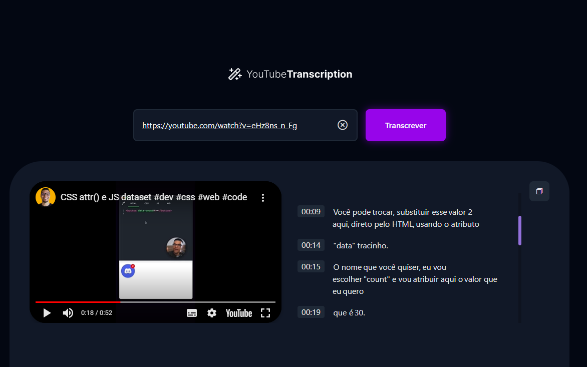

# video-transcription

## Summary

1. [Description](#description)
2. [How to start](#how-to-start)
3. [Technologies](#technologies)

## Description

Project Video Transcription is a project to help transcribe videos.  

  

## How to start

1. Clone this repo.

# nlw-spacetime

## Summary

1. [Description](#description)
2. [How to start](#how-to-start)
3. [Technologies](#technologies)

## Description

Project NLW Spacetime is a memory timeline.  
You can create a new memory and share if you want, and see others publics memories too.

  

## How to start

1. Clone this repo.
2. Download dependencies

   > npm i

3. Start project

   > npm run dev

4. Start backend
   > npm run dev

## Technologies

- HTML
- CSS
- VanillaJS
    
